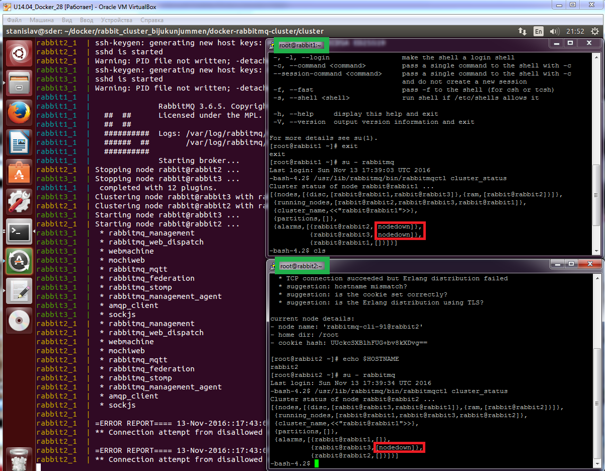
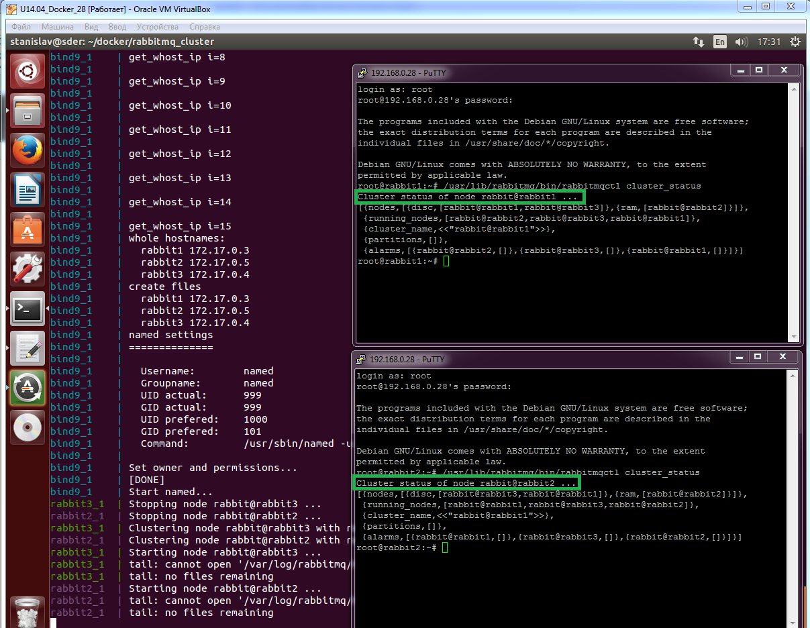
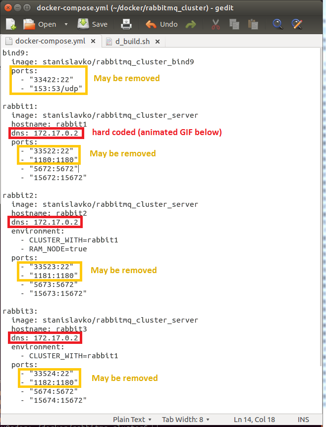
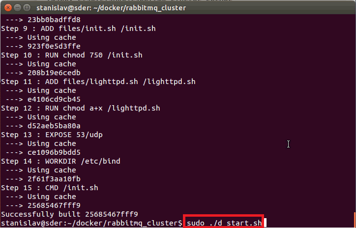

Dockerfiles for building RabbitMQ cluster

Why https://github.com/bijukunjummen/docker-rabbitmq-cluster/ doesn't work
------------
Nodes don't see each other:

This cluster is configured better
------------
Nodes are accessible from each other:

YAML file
------------
Typical configuration:

DNS hard code can be found during starting up

